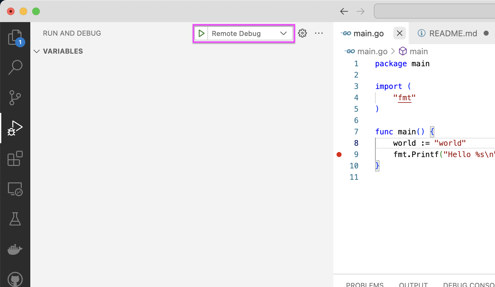
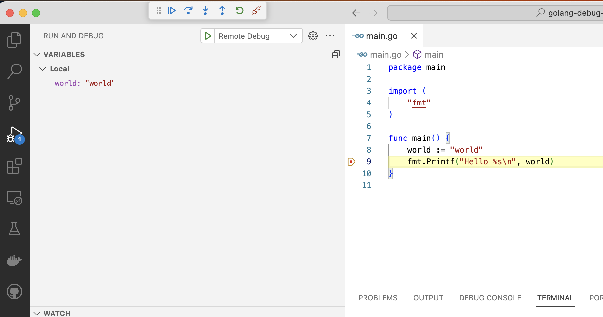

# Remote Debugging Golang with VSCode

## Build

To debug golang, you need to build golang project with `-gcflags "all=-N -l"`.

```bash
$ go build -gcflags "all=-N -l" -o golang-debug
```

## Configure VSCode

Add `launch.json` to `.vscode` folder.

```json
{
    "version": "0.2.0",
    "configurations": [
        {
            "name": "Remote Debug",
            "type": "go",
            "request": "attach",
            "mode": "remote",
            "port": 2345,
        }
    ]
}
```

## Launch and Attach

If you don't have `dlv`, install it with `go install`.

```bash
$ go install github.com/go-delve/delve/cmd/dlv@latest
```

Launch the program with `dlv` command.

```bash
$ dlv --listen=:2345 --headless=true --api-version=2 exec ./golang-debug
API server listening at: [::]:2345
2024-01-03T21:55:14+09:00 warning layer=rpc Listening for remote connections (connections are not authenticated nor encrypted)
debugserver-@(#)PROGRAM:LLDB  PROJECT:lldb-1500.0.200.58
 for arm64.
Got a connection, launched process /Users/toshi/tmp/golang-debug-example/golang-debug (pid = 96092).

```

Set breakpoints and start debugging with `Remote Debug` configuration.



Now you can see the program is stopped at the breakpoint.



